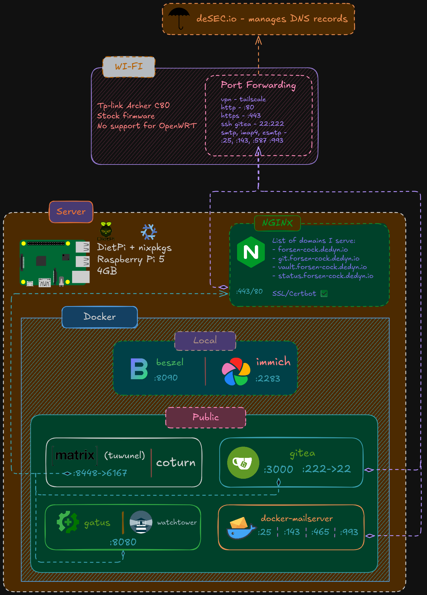

# ~ > whoami
I'm a Ukrainian student and a unix/linux & open-source enthusiast, trying to get into cybersecurity, gain some practical skills


# My interests are:
- cybersecurity
- low-level programming: C, Rust, Zig, C++, Assembly (I know slightly about each one, but not to the level of creating big projects)
- reverse engineering (IDA, Ghidra, NinjaBinary)
- electrical engineering
- PCB designing, KiCad (yet to try this stuff)
- self-hosting
- a little bit of 3d
- a little bit of game developing

---

# Self-hosting

I have a Raspberry Pi 5 with 4GB of RAM and RaspberryPi OS (i hate outdated debian packages)

And I'm hosting a bunch of stuff on it right now



Basically some docker containers with help of desec.io, I host my domain there for free

---

# Some project I have
## [Facinus](https://git.forsen-cock.dedyn.io/elleoma/facinus)

Since our college decided to switch from windows to ubuntu, I got a cool idea to have remote control over my college PCns in computer class
I knew that there is this cool open-source project called gsocket.io that lets you quickly deploy their soft on any device that runs linux
So I started my development by setting up an ubuntu VM in Qemu and with the help of AI I started bash scripting my tool that deploys a local web server with admin panel that receives logs from 'hacked' PCs.

---

# Cybersecurity
My main interest that I have for around 2 years.
I had a classic, normie approach at first - installed Kali on my laptop as a double OS setup, next to the windows
It wasn't for the first time, I did it in a VM but couldn't get wifi working properly, I didn't know I had to have a wifi dongle because hosts wifi module wouldn't passthrough to VM
Since then I slowly started spending more time using linux than windows, loved configuring things, moved to KDE Plasma, riced my terminal - basic stuff
I have a lot of things to learn yet, I would like to write all different kinds of things I'm familiar with, though I'm not sure how yet since there so many stuff!

## HackTheBox
I knew about TryHackMe and maybe some other resources (like reddit lol) where I can try to get into cybersec/hacking stuff, found out about HackTheBox and really liked their approach to the new people in the industry
I enjoyed 'getting started' guides with pdfs it gave me that practical knowledge I needed and since then I got addicted to CTFs
Right now I have 48 root/user owns and 3 of them are insane boxes - DarkCorp, Mist (did it with the ippsec guide but got insane amount of knowledge) and MassGarden
To be honest, I did almost all of them with the help of leaked or official writeups, so I'm not that skilled, I just wanted to understand the box infrastructure without spending a lot of time in random rabbit holes because of the lack of my practical knowledge skills
I don't know if I have been doing a big mistake with that, I don't really know the best way to approach such things. Probably researching different things and trying to find new approaches would get me waaayy more knowledge rather than spoiling the whole process to myself

## russian targets
I'm Ukrainian so I can also sharpen my skills on real targets in russia. I think it is morally right and legal (at least for me), fun and also helpful :)

# Bug-bounty
My opinion on bug-bounty is pretty simple - I really like the concept: you hack the in-scope targets and if you find something vulnerable - you report it and eventually get some money ;)
The other side of the coin is that the money you would get is not rewarding for the time, effort you have spent and often the impact of the vulnerability itself. It is ESPECIALLY hard if you are a beginner, like me
I tried several programs, spent a day or two researching, doing reconnaissance and simple attacks but never have I found any vulnerability. I should probably spend more time to get something interesting out of these programs but it gets always so messy to analyze every aspect of the target after some time, that I lose any motivation for it. Understanding that my skills are not high enough lead me to think I should focus more on learning new vectors of attacks and apply them on corresponding targets.
Also it's not always easy to find a good program that doesn't have an insanely big infrastructure that you need to analyze. It becomes difficult to find something interesting in a pile of mess

# My setup
It's pretty simple - a laptop with Arch Linux, I use it becaus it just works and gets the job done :)

To be more specific, here is my fastfetch output:

```
~/shit/notes   main  !? ❯ fastfetch                             

   OS : Arch Linux x86_64
   Kernel : Linux 6.15.5-arch1-1
   Packages : 2025 (pacman), 10 (flatpak-system), 1 (flatpak-user)
   Display : 1920x1080 @ 144 Hz in 15" [Built-in]
   WM : Hyprland 0.49.0 (Wayland)
   Terminal : tmux 3.5a

   CPU : 12th Gen Intel(R) Core(TM) i7-12650H
   GPU : GeForce RTX 4060 Max-Q / Mobile
   GPU : UHD Graphics
   GPU Driver : nvidia (proprietary) 575.64.03
   GPU Driver : i915
   Memory : 9.28 GiB / 15.32 GiB (61%)
   OS Age  : 182 days
   Uptime  : 9 hours, 40 mins
```

I use Hyprland as a DE and a separate preconfigured project - HyDE. And neovim with NVChad as a text editor

You can check my dotfiles here: [dotfiles](https://git.forsen-cock.dedyn.io/elleoma/dotfiles)
